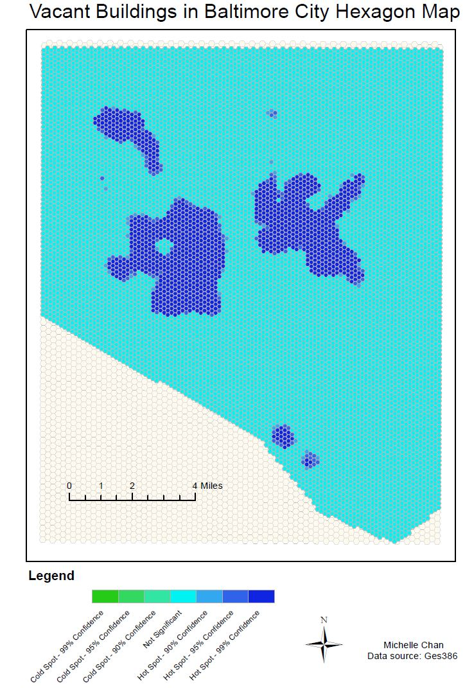
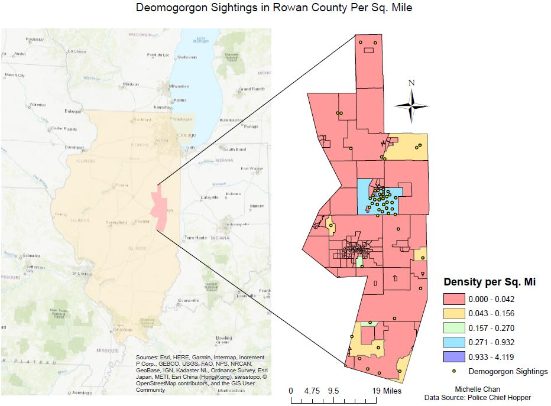

## Portfolio
---

<a href="pdf/lab5part1a-merged.pdf">Full Project</a> | Correlation between Vacant Housing and Rats in Baltimore
  

 
  
*Project done to analyze the correlation between vacant housing/lots in Baltimore with the influx of rats from 2017 and 2018. Hexagonal maps used to normalize region in order to decrease disparity.* 
 
----------

<a href="pdf/practical2_pt1-merged.pdf">Full Project</a> | Risk Charts and Network Analysis
  

 
  
*Fictional project done by adding several risk factors together to create a spatial distribution risk chart in order to provide evidence against Demogorgans. Use of network analysis in ArcGIS.*
 

---

Page template forked from <a href="https://github.com/evanca/quick-portfolio">evanca</a>

<!-- Remove above link if you don't want to attibute -->

